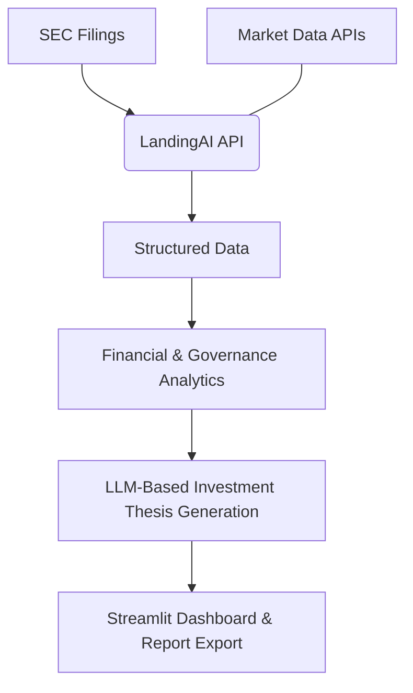

## Shareholder Catalyst — AI-Powered Activist Investor Intelligence

View website: https://financeaihackathon-anshul-sanjana.streamlit.app/

Shareholder Catalyst is an AI-powered platform that reimagines how activist investors identify opportunities and inefficiencies in public companies.

It combines document intelligence, financial modelling, and AI-driven reasoning to turn dense corporate filings into actionable insights — enabling faster, smarter, and more transparent investment decisions.

## Why We Built This

The research behind activist investing is often tedious, fragmented, and human-limited. Analysts spend weeks combing through SEC filings, proxy statements, and financial ratios — a process that is prone to bias and data overload.

## We wanted to ask:

What if AI could read, understand, and interpret corporate filings like an analyst — but faster and with more consistency?

Shareholder Catalyst was built to answer that question.

It transforms unstructured filings into structured intelligence, evaluates financial and governance performance, and generates clear investment theses — all within an interactive AI-driven dashboard. 

Our goal was not just to build a tool, but to create a framework for financial reasoning — one that blends domain expertise with automation.

## What It Does

•	Document Intelligence: Extracts structured insights from SEC filings (10-K, 8-K, proxy statements) using LandingAI.

•	Financial Analysis: Computes activist-relevant metrics — ROE, ROIC, cash efficiency, leverage, and profitability.

•	Governance Evaluation: Analyses board composition, tenure, compensation alignment, and independence.

•	AI Thesis Generation: Synthesises financial and governance data into a coherent investment rationale using large language models.

•	Interactive Dashboard: Offers an analyst-friendly Streamlit interface to explore results dynamically.

•	Professional Reporting: Exports findings as structured reports (PDF, JSON, Markdown) for sharing or archival use.

## How It Works

The workflow integrates three core pillars:
	
1.	LandingAI’s document intelligence for parsing unstructured SEC data.
	
2.	Custom ratio and peer analysis models for financial computation.
	
3.	LLM-based reasoning layer (OpenAI / Claude) to interpret signals like an analyst.

## Implementation Highlights

1. Document Intelligence

   •	Integrated LandingAI Document Intelligence API to process SEC filings in multiple formats (HTML, PDF, text).

   •	Extracted key metrics including revenue, assets, cash flow, and governance details from proxy statements.
    
2. Financial Analytics

   •	Developed a modular Ratio Calculator to compute KPIs such as ROE, ROIC, and cash efficiency.

   •	Implemented peer benchmarking for relative performance analysis across industries.
    
3. Governance Modelling

   •	Parsed board data to assess tenure diversity, independence, and compensation alignment.

   •	Combined these into a composite governance risk score that feeds into the activist index.
    
4. AI-Generated Thesis

   •	Used large language models to summarize findings into a concise, human-readable investment thesis.

   •	Automatically identifies catalysts such as excess cash, underutilised capital, or leadership concentration.
    
5. Dashboard & Reporting

   •	Built with Streamlit, featuring interactive tabs for Executive Summary, Financials, Governance, and Thesis.

   •	Outputs reports in multiple formats — ideal for investor presentations or internal research reviews.

## Sample Insight

Example: Apple Inc. (AAPL)

Key Catalysts:

•	Excess cash reserves earning minimal return (potential capital reallocation signal).

•   Board tenure imbalance suggesting need for refreshment.

Financial Highlights:

•	ROE: 147% | ROIC: 28% | Operating Margin: 29.8%

•	Market Cap: $2.8T | Revenue Growth: -2.8% YoY

AI Thesis Summary:

“Apple shows exceptional profitability but limited reinvestment efficiency. Activist opportunities may lie in cash redeployment and governance refresh.”

## Quick Start

# Clone repository
git clone https://www.github.com/anshuldani/finance_ai_hackathon
cd shareholder-catalyst-landingai

# Install dependencies
pip install -r requirements.txt

# Run demo mode (no API keys required)
streamlit run app.py

Demo mode includes pre-loaded data for companies like AAPL, MSFT, and GOOGL, allowing full exploration without configuration.

## Architecture Overview

•	Data Layer: SEC filings (EDGAR) + market data (Yahoo Finance)

•	Processing Layer: LandingAI document parsing + custom ratio engine

•	Reasoning Layer: LLM-based interpretation for activist insights

•	Presentation Layer: Streamlit dashboard + export-ready reports

## Tech Stack

| Category | Tools Used |
| :--- | :--- |
| **Core Frameworks** | Python, Streamlit, AsyncIO |
| **AI & APIs** | LandingAI, OpenAI GPT-4, Anthropic Claude |
| **Data Sources** | SEC EDGAR, Yahoo Finance |
| **Libraries** | Pandas, NumPy, Requests, ReportLab, YFinance, dotenv |
| **Output Formats** | PDF, Markdown, JSON |

## Security & Reliability

•	Uses .env configuration for secure API key management.

•	No permanent data storage — all processing is session-based.

•	Graceful fallbacks for missing API responses.

•	Average runtime: ~45 seconds per company profile.

## Why It Matters

Shareholder Catalyst represents the next step in data-driven governance and financial intelligence.

It showcases how AI can bridge the gap between quantitative rigour and strategic interpretation, transforming how investors uncover value.

By blending document intelligence, financial modelling, and AI reasoning, this project highlights a future where human insight and machine precision work together — not to replace analysts, but to amplify their reach and speed.

“Our goal was to make corporate activism smarter, faster, and more transparent — powered by AI that understands the language of finance.”

## 👥 Contributors

Sanjana Waghray — Data Scientist & AI Engineer
M.S. Data Science @ Illinois Tech Chicago
🔗 sanjanawaghray.com

Anshul Dani — Full-Stack & AI Engineer
M.S. Artificial Intelligence @ Illinois Tech Chicago
🔗 anshuldani.com
